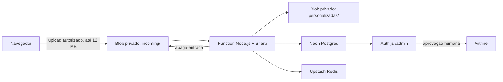
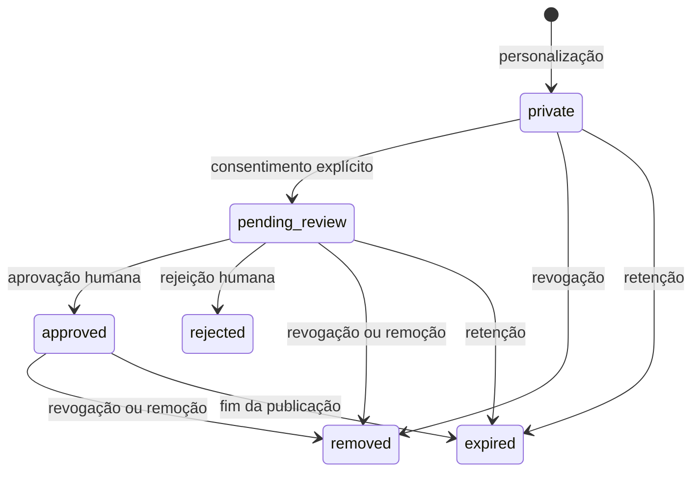

# WTICIFES 2026 — Eu fui, tchê!

Aplicação web standalone, pronta para Vercel, que recebe uma fotografia e acrescenta de forma determinística o logo oficial do WTICIFES 2026 e a frase **“Eu fui, tchê!”**. Cada personalização usa somente Sharp e ativos estáticos aprovados, sem chamada a IA. Não há integração com ChatGPT nem aprovação automática.

## Arquitetura



A Vercel limita corpos de Functions a 4,5 MB. Para aceitar 12 MB sem expor credenciais, o navegador usa o fluxo oficial de Client Upload do Vercel Blob. A entrada fica no store privado pelo menor tempo possível: o servidor valida a reserva, lê no máximo 12 MB e apaga o objeto antes de executar o Sharp. Uploads abandonados tornam-se elegíveis após uma hora e são removidos no ciclo horário seguinte. Somente o JPEG final é retido.

O compositor preserva toda a foto, respeita EXIF, nunca recorta nem amplia, reduz apenas por segurança/desempenho e limita a área fotográfica a 2400 × 4000. O logo fica à esquerda e o lettering artístico à direita, sobre uma tarja branca translúcida dentro da própria foto. A saída é JPEG sRGB qualidade 90 sem metadados. Caso um resultado ultrapasse o limite seguro de resposta da Function, ele é reduzido deterministicamente, sem distorção e ainda em qualidade 90.

## Estados e publicação



Uma imagem só entra no feed se tiver simultaneamente `status=approved`, consentimento registrado, ausência de remoção/exclusão e prazo de publicação futuro. Cada download valida o estado e `token_version` no Postgres. Revogação e remoção incrementam essa versão, bloqueiam novas URLs imediatamente e solicitam exclusão física. URLs da vitrine duram cinco minutos e nunca expõem caminho do Blob, ID administrativo, participante, hashes ou auditoria.

## Proteções contra abuso

- Upstash Redis, nunca memória local, aplica limites globais por minuto/hora/dia e teto diário rígido.
- Um token opcional de participante vira somente `HMAC-SHA-256(RATE_LIMIT_SECRET, token)`; o valor original nunca é persistido.
- Limites independentes por participante: hora, dia e total persistente.
- Reserva de upload, idempotência por `request_id`, lock por requisição e por SHA-256 do conteúdo.
- Deduplicação global: o mesmo conteúdo não dispara Sharp novamente dentro da janela; um resultado só é reutilizado para a mesma requisição ou participante.
- Semáforo distribuído limita processamento simultâneo; lock duplicado retorna 409 e limites retornam 429 com `Retry-After`.
- Erros de arquivo acumulam tentativas por identidade de rede pseudonimizada e ativam bloqueio temporário.
- `GENERATION_ENABLED=false` interrompe novos uploads e processamentos antes de custo relevante.
- JPEG/PNG/WebP são verificados por bytes reais e Sharp; SVG, animação, conteúdo disfarçado, excesso de pixels e dimensões mínimas inválidas são rejeitados.
- CSP estrita com nonce exclusivo por requisição, HSTS, `nosniff`, bloqueio de frames, Blob privado e logs estruturados sem IP, tokens ou URLs completas.

## Desenvolvimento

Requisitos: Node.js 20.9+, npm, um Postgres compatível e Redis Upstash. Copie `.env.example` para `.env.local`, preencha somente valores locais e execute:

```bash
npm install
npm run db:migrate
npm run dev
```

Migrations Drizzle ficam em `drizzle/`. Para alterar o schema:

```bash
npm run db:generate
npm run db:check
npm run db:migrate
```

Não execute `drizzle-kit push` em produção. Faça backup ou crie uma branch Neon, aplique `npm run db:migrate`, valide a aplicação e só então promova. Para restaurar, use a restauração point-in-time/branch do Neon e aponte `DATABASE_URL` para a branch recuperada antes de redeployar.

## Variáveis de ambiente

| Variável | Obrigatória | Uso |
| --- | --- | --- |
| `DATABASE_URL` | Sim | Conexão Neon Postgres com TLS. |
| `UPSTASH_REDIS_REST_URL`, `UPSTASH_REDIS_REST_TOKEN` | Sim | Rate limit, locks, cooldown e idempotência. A integração nativa também pode fornecer `UPSTASH_REDIS_REST_KV_REST_API_URL` e `UPSTASH_REDIS_REST_KV_REST_API_TOKEN`. |
| `BLOB_READ_WRITE_TOKEN` | Sim | Store Vercel Blob criado como **private**. |
| `DOWNLOAD_SIGNING_SECRET` | Sim | Assinatura HMAC dos links; mínimo 32 caracteres. |
| `RATE_LIMIT_SECRET` | Sim | HMAC de participante/rede/request; mínimo 32 caracteres. |
| `ADMIN_AUDIT_SECRET` | Recomendada | Pseudônimo estável do moderador; se ausente usa `RATE_LIMIT_SECRET`. |
| `CRON_SECRET` | Sim | Bearer enviado automaticamente pelo Vercel Cron. |
| `NEXT_PUBLIC_APP_URL` | Sim em produção | Origem HTTPS canônica e validação CSRF. |
| `AUTH_SECRET` | Sim | Segredo Auth.js. |
| `AUTH_GITHUB_ID`, `AUTH_GITHUB_SECRET` | Sim | OAuth App GitHub. |
| `ADMIN_EMAIL_ALLOWLIST` | Sim | E-mails administrativos, separados por vírgula. |
| `GENERATION_ENABLED` | Não | Kill switch; padrão `true`. |
| `GLOBAL_MAX_PER_MINUTE/HOUR/DAY` | Não | Padrões 20/200/2000. |
| `HARD_DAILY_LIMIT` | Não | Teto diário rígido; padrão 2000. |
| `MAX_CONCURRENT_PROCESSING` | Não | Padrão 5. |
| `DUPLICATE_WINDOW_SECONDS` | Não | Padrão 86400. |
| `INVALID_ATTEMPT_BLOCK_SECONDS`, `INVALID_ATTEMPT_THRESHOLD` | Não | Padrões 1800 e 5. |
| `PARTICIPANT_MAX_PER_HOUR/DAY/TOTAL` | Não | Padrões 5/10/20. |
| `BLOB_TTL_HOURS` | Não | Link privado inicial; padrão 24. |
| `PRIVATE_RETENTION_HOURS` | Não | Padrão 24. |
| `PENDING_REVIEW_RETENTION_HOURS` | Não | Padrão 72. |
| `REJECTED_RETENTION_HOURS` | Não | Padrão 1. |
| `APPROVED_RETENTION_DAYS` | Não | Padrão 30. |
| `SHOWCASE_FEED_LIMIT` | Não | Máximo de fotos carregadas no mosaico; padrão 20. |
| `CONTENT_SAFETY_PROVIDER` | Não | Deve permanecer `manual`; falha fechada para outro valor. |

Nunca versionar `.env.local`. Use valores aleatórios diferentes e com pelo menos 32 caracteres para cada segredo.

## Configuração na Vercel

### Blob privado

Em **Storage → Create Database → Blob**, crie um store com acesso **Private** e conecte-o ao projeto. Não é possível converter depois um store público em privado; confirme o modo antes de usar. A integração cria `BLOB_READ_WRITE_TOKEN` (ou OIDC em contas compatíveis).

### Neon Postgres

1. Abra **Storage → Create Database → Marketplace → Neon** e crie/conecte o projeto.
2. Habilite Production e Preview conforme sua política; confirme `DATABASE_URL` em cada ambiente.
3. Ative branches Neon por deployment de Preview para isolar dados e alterações de schema.
4. O script `vercel-build` executa `npm run db:migrate` antes do build e aplica somente migrations versionadas ainda pendentes no banco daquele ambiente.
5. Confirme as tabelas `images`, `moderation_audit`, `blocked_participants` e os índices da migration antes do primeiro tráfego.

O `vercel.json` executa a retenção aos 15 minutos de cada hora; use um plano que aceite essa frequência de Cron. Se o plano permitir apenas execução diária, uploads abandonados podem permanecer privados por até cerca de 25 horas, embora envios concluídos continuem sendo apagados imediatamente.

### Upstash Redis

1. Abra **Storage → Create Database → Marketplace → Upstash Redis**.
2. Escolha uma região próxima da Function/Neon e conecte o banco.
3. Confirme `UPSTASH_REDIS_REST_URL` e `UPSTASH_REDIS_REST_TOKEN`, ou o par gerado pela integração nativa `UPSTASH_REDIS_REST_KV_REST_API_URL` e `UPSTASH_REDIS_REST_KV_REST_API_TOKEN`; ambos são reconhecidos.
4. Não compartilhe esse Redis com aplicações não confiáveis; as chaves usam prefixo `wticifes:`.
5. Teste um limite baixo em Preview e confirme 429 + `Retry-After` antes de restaurar os valores de produção.

### GitHub OAuth e primeiro administrador

1. No GitHub, acesse **Settings → Developer settings → OAuth Apps → New OAuth App**.
2. Use o domínio final em **Homepage URL**.
3. Use exatamente `https://SEU-DOMINIO/api/auth/callback/github` em **Authorization callback URL**.
4. Copie Client ID para `AUTH_GITHUB_ID`, gere um Client Secret para `AUTH_GITHUB_SECRET` e crie `AUTH_SECRET` com `openssl rand -base64 32` ou gerador equivalente.
5. Defina `ADMIN_EMAIL_ALLOWLIST` com o e-mail verificado do primeiro moderador. E-mails são normalizados para minúsculas.
6. Redeploy, abra `/admin` em janela privada e autentique. Uma conta fora da lista deve receber negação do GitHub/Auth.js e jamais visualizar a fila.

Se qualquer variável de Auth.js ou a allowlist faltar, `/admin` falha fechado. Cada handler administrativo repete sessão e allowlist no servidor, e mutações também exigem origem canônica e token CSRF de curta duração.

### Vercel WAF

No projeto, abra **Firewall → Configure → New Rule**. Em cada regra escolha condições, ação, salve, use **Review Changes** e depois **Publish**:

1. `personalizar-rate`: condição Path equals `/api/personalizar` e Method equals `POST`; ação **Rate Limit**, chave IP, janela 1 minuto, 10 requisições, resposta 429.
2. `upload-token-rate`: Path equals `/api/upload` e Method equals `POST`; **Rate Limit**, chave IP, janela 1 minuto, 20 requisições.
3. `public-mutation-methods`: para `/api/personalizar`, `/api/upload`, `/api/vitrine/submeter` e `/api/vitrine/revogar`, negue métodos diferentes de `POST`.
4. `admin-protection`: Path starts with `/admin` ou `/api/admin`; aplique **Challenge** a padrões anormais. Não desafie `/api/auth/callback/github`.
5. `showcase-feed`: Path equals `/api/vitrine/feed` e Method equals `GET`; **Rate Limit** de 120/min/IP, alinhado ao limite distribuído interno.
6. `health-isolated`: Path equals `/api/health`; permita apenas `GET` e aplique rate limit separado (por exemplo 60/min/IP) para que sondagens não afetem geração.
7. Comece regras de heurística em **Log**; após observar falsos positivos, altere para **Challenge** ou **Deny**. Não crie bypass amplo. Se necessário, limite bypass por path exato, método e origem de infraestrutura conhecida.
8. Em **Observability/Alerts**, alerte para picos de 401, 403, 409, 429 e 5xx, aumento de duração, tráfego em `/api/upload` sem `/api/personalizar` e uso acima de 70%, 90% e 100% do teto diário.

O WAF complementa o Upstash; não o substitui. Janelas fixas estão disponíveis em todos os planos atuais, mas confirme os limites do seu plano no painel.

## Operação e incidentes

### Desligar geração

Altere `GENERATION_ENABLED=false` em Production e faça redeploy. Upload e personalização passam a responder 503 antes de processar. A vitrine, revogação e painel continuam disponíveis. Em incidente grave, publique também uma regra WAF temporária negando `POST /api/upload` e `POST /api/personalizar`.

### Excluir ou revogar uma imagem

Prefira o botão de revogação do participante ou **Remover da vitrine** em `/admin`; ambos invalidam o estado antes de excluir o Blob. Em emergência, obtenha o UUID em `images`, altere o status para `removed`, preencha `removed_at`, incremente `token_version`, registre uma linha em `moderation_audit` sem PII e delete o `blob_path` pelo dashboard/CLI privado. Nunca compartilhe o caminho em tickets públicos.

### Verificar auditoria

Um administrador pode consultar `GET /api/admin/auditoria`. No banco, filtre `moderation_audit` por `image_id`, `created_at` ou `request_id`. `moderator_id` é HMAC, não e-mail. A auditoria não contém foto, URL assinada, token, IP ou chave.

### Abuso

Ative o kill switch se houver custo ou fila fora de controle; preserve logs sem PII; identifique o prefixo de limite responsável; bloqueie padrões no WAF; use **Bloquear participante** somente quando existir hash do participante; reduza limites via variáveis; depois investigue locks, contadores e fila. Nunca coloque IP bruto em tickets ou logs adicionais.

### Vazamento e rotação de segredos

1. Desative geração e restrinja rotas no WAF.
2. Revogue primeiro o segredo exposto no provedor (GitHub, Upstash, Neon ou Blob).
3. Gere novo valor, atualize Production/Preview/Development e redeploy.
4. Ao trocar `DOWNLOAD_SIGNING_SECRET`, todos os links atuais deixam de validar. Ao trocar `RATE_LIMIT_SECRET`, tokens de consentimento/revogação derivados anteriormente deixam de funcionar; planeje uma janela de suporte e remova manualmente imagens afetadas quando solicitado.
5. Revise logs, auditoria, acessos administrativos e custos; só reative após validação.

## Logo oficial

`public/wticifes2026-logo.png` contém exatamente 140.341 bytes da origem oficial, SHA-256 `70a722d1993806f761948ab12db508c72f0149ad78c307d09953583c6d1390e6`. Execute `npm run verify-logo` para comparar novamente os bytes. `npm run extract-brand-colors` reproduz as cores documentadas em `src/lib/brand.ts`: vermelho `#C90216`, amarelo `#FFB303` e verde `#679157`.

## Testes e entrega

```bash
npm run verify-logo
npm run db:check
npm run test:integration
npm test
npm run lint
npm run typecheck
npm run build
npm run test:e2e
npm audit --omit=dev
```

Roteiro manual mínimo:

1. Envie JPG, PNG e WebP horizontal, vertical e quadrado; valide orientação, foto inteira, sobreposição translúcida e download.
2. Tente SVG renomeado, animação, arquivo >12 MB e imagem acima de 40 MP.
3. Confirme que personalizar não coloca a imagem no feed.
4. Marque consentimento; confirme `pending_review` e ausência no feed.
5. Entre com admin permitido, tente mutação sem CSRF, aprove uma única imagem e confirme auditoria.
6. Abra `/vitrine` em celular e tela cheia; confirme o mosaico masonry responsivo, proporções integrais, rolagem automática e QR Code central apontando para a página principal.
7. Revogue; confirme sumiço no próximo refresh e falha do URL anterior.
8. Rejeite/remova e confirme exclusão física ou retomada pelo cron.
9. Reduza limites temporariamente e valide 409, 429, `Retry-After`, cooldown e `GENERATION_ENABLED=false`.
10. Execute o cron com Bearer correto e incorreto; verifique expirados, Blob órfão e upload transitório abandonado.
